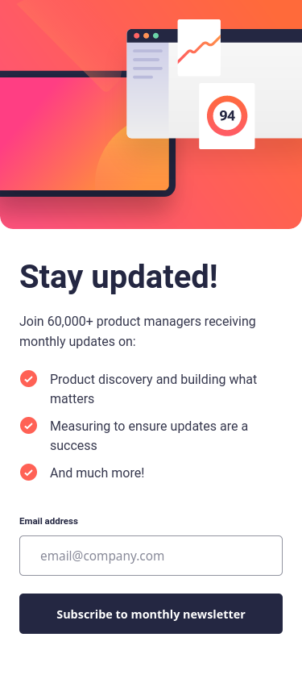
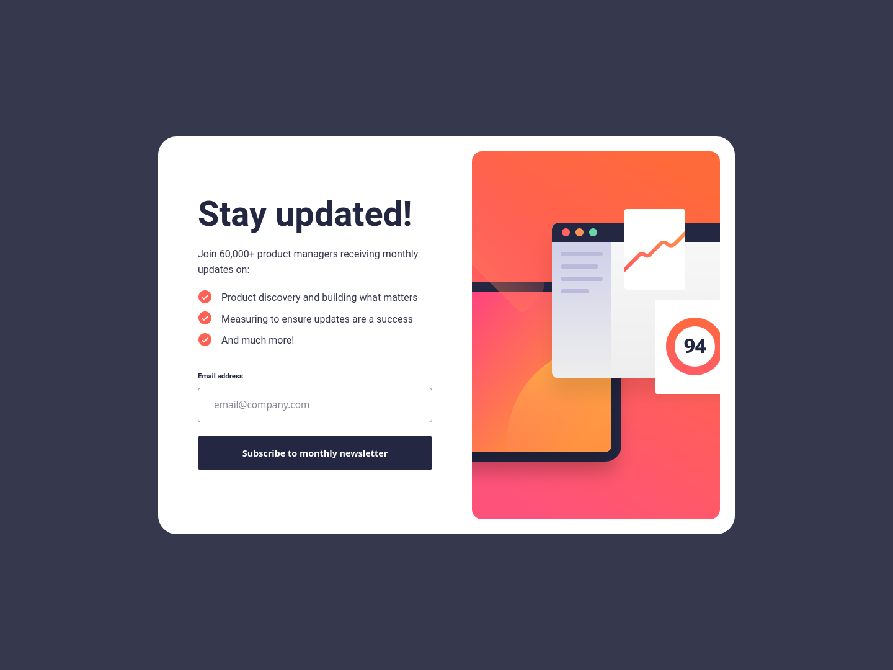

# Frontend Mentor - Newsletter sign-up form with success message solution

This is a solution to the [Newsletter sign-up form with success message challenge on Frontend Mentor](https://www.frontendmentor.io/challenges/newsletter-signup-form-with-success-message-3FC1AZbNrv). Frontend Mentor challenges help you improve your coding skills by building realistic projects. 

## Table of contents

- [Overview](#overview)
  - [The challenge](#the-challenge)
  - [Screenshot](#screenshot)
  - [Links](#links)
- [My process](#my-process)
  - [Built with](#built-with)
  - [Continued development](#continued-development)
- [Author](#author)

## Overview

### The challenge

Users should be able to:

- Add their email and submit the form
- See a success message with their email after successfully submitting the form
- See form validation messages if:
  - The field is left empty
  - The email address is not formatted correctly
- View the optimal layout for the interface depending on their device's screen size
- See hover and focus states for all interactive elements on the page

### Screenshot

#### Mobile

#### Desktop

### Links

- Solution URL: [https://github.com/JunoField/fmj8-newsletter-sign-up-form](https://github.com/JunoField/fmj8-newsletter-sign-up-form)
- Live Site URL: [https://junofield.github.io/fmj8-newsletter-sign-up-form](https://junofield.github.io/fmj8-newsletter-sign-up-form)

## My process

### Built with

- Flexbox
- Mobile-first workflow
- [React](https://reactjs.org/) - frontend JS library
- Vite - a global Node module used to create a React app.

### Continued development

This is my first React project that hasn't used React Bootstrap, so I'm not 100% sure whether the way I've done CSS is the most appropriate for a React project. Any feedback would be appreciated.

### Author

- GitHub - [JunoField](https://github.com/JunoField)
- Frontend Mentor - [@JunoField](https://www.frontendmentor.io/profile/JunoField)

